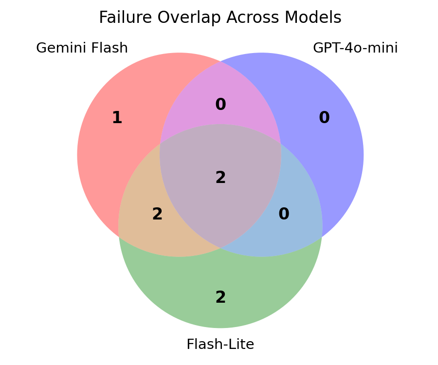

# Thai Transaction NER — Eval Report

Evaluation of 3 LLMs on 80 Thai financial transaction examples (happy / messy / adversarial) to select the best model for Parnuan's transaction extraction feature.

---

## Model Comparison

| Model | Exact Match | CntAcc | F1 amt | F1 det | p50 | p95 | บาท/1k |
|---|---:|---:|---:|---:|---:|---:|---:|
| google/gemini-2.5-flash | 93.8% | 95.0% | 0.945 | 0.921 | 1.14s | 1.56s | 6.35฿ |
| **openai/gpt-4o-mini** | **97.5%** | **100.0%** | **0.975** | 0.911 | 1.38s | 1.98s | **2.72฿** |
| google/gemini-2.5-flash-lite | 92.5% | 95.0% | 0.951 | **0.864** | 2.08s | 2.62s | 1.79฿ |

- **Exact Match** — substring match (pred inside gold or gold inside pred counts as correct)
- **CntAcc** — % of examples where the number of extracted transactions matches gold
- **Dataset** — 80 examples: 20 happy, 30 messy, 30 adversarial

---

## Failure Analysis

### Failure Taxonomy (substring match)

| Model | wrong_amount | wrong_detail | wrong_both | missed | hallucinated | Total |
|---|:---:|:---:|:---:|:---:|:---:|:---:|
| gemini-2.5-flash | 2 | 0 | 0 | 0 | 3 | **5** |
| gpt-4o-mini | 2 | 0 | 0 | 0 | 0 | **2** |
| gemini-2.5-flash-lite | 2 | 0 | 0 | 0 | 4 | **6** |

- `wrong_amount` — amount extracted incorrectly (e.g. multiplication/division not computed)
- `hallucinated` — model extracted transactions from adversarial inputs that should return `[]`
- After applying substring match, `wrong_detail` failures drop to 0 — prefix-stripping (`ค่า` → dropped) is acceptable

### Hard Cases — Failed by All 3 Models

- **[34]** `"moo ping 20 baht x3"` — gold: `[{amount: 60, detail: "moo ping"}]`
  All models returned 20 (unit price) instead of computing 20 × 3 = 60.

- **[39]** `"หารมื้อเย็นกัน 2 คน 100"` — gold: `[{amount: 50, detail: "มื้อเย็น"}]`
  All models returned 100 (total) instead of computing 100 ÷ 2 = 50.

Both are arithmetic reasoning failures — the prompt does not include examples of multiplication or split-bill patterns.

### Failure Overlap — Venn Diagram

GPT-4o-mini's failure set is entirely contained within the other models' failures — it has no unique weaknesses. Flash and Flash-Lite each have additional adversarial hallucinations the others avoided.

---

## Cost Optimization — Tiered Approach

A regex fast-path (`tiered.py`) intercepts simple cases before they reach the LLM. Three rules return a result for free; two safety rules force an LLM call even when input looks simple:

**"per 1k"** = cost if 1,000 messages are sent to the system, scaled from the 80-example dataset (×12.5). All figures use GPT-4o-mini pricing.

### Cost Breakdown per Rule (per 1,000 messages)

| Rule | ~Cases/1k | Before (LLM cost) | After (regex) | Saved/1k |
|---|---:|---:|---:|---:|
| **single_clean** — 1 number + short detail | 388 | 1.06฿ | 0฿ | **1.06฿** |
| multi_amount — 2+ numbers | 212 | 0.67฿ | 0.67฿ | — |
| **no_amount** — no digit at all | 112 | 0.28฿ | 0฿ | **0.28฿** |
| risk_marker — injection keywords | 100 | 0.27฿ | 0.27฿ | — |
| **no_detail** — number only, no item name | 62 | 0.16฿ | 0฿ | **0.16฿** |
| not_money_cue — age / time / unit words | 50 | 0.14฿ | 0.14฿ | — |
| long_detail / validate_failed | 38 | 0.12฿ | 0.12฿ | — |
| **empty** — blank / whitespace | 38 | 0.03฿ | 0฿ | **0.03฿** |
| **Total** | **1,000** | **2.72฿** | **1.20฿** | **1.53฿** |

Rows without a "Saved" value are routed to the LLM — regex cannot safely handle them (ambiguous amounts, injection risk, non-monetary numbers).

The **single_clean** rule alone accounts for **69% of total savings** (1.06฿ out of 1.53฿). It handles the most common real-world pattern: a short Thai message with one amount and one item.

### Results vs. LLM-Only Baseline

| Approach | Exact Match | Cost/1k | LLM Calls |
|---|---:|---:|---:|
| GPT-4o-mini (LLM only) | 97.5% | 2.72฿ | 80 / 80 |
| Tiered (regex + GPT-4o-mini) | 95.0% | 1.20฿ | 32 / 80 |

- Cost reduction: **56%** (2.72฿ → 1.20฿ per 1k)
- Accuracy delta: **−2.5 pp** — the 2 cases lost are adversarial edge cases the fast-path over-eagerly classifies as no-transaction
- At Parnuan's scale, the tradeoff is favorable: the fast-path rules are conservative and can be tightened without retraining the LLM

---

## Recommendation

**Recommended model: `openai/gpt-4o-mini`**

GPT-4o-mini achieves the highest exact match (97.5%) and perfect count accuracy (100%) on this dataset, meaning it never over- or under-extracts the number of transactions — the most critical correctness signal for a personal finance app. Its only failures are two hard arithmetic cases (multiplication and split-bill) that all three models get wrong equally, so they represent a prompt improvement opportunity rather than a model weakness. Flash-Lite is cheaper at 1.79฿/1k but scores 5 pp lower on exact match and hallucinates on 4 adversarial inputs compared to GPT-4o-mini's 0 — an unacceptable tradeoff for a finance context. With the tiered optimization applied, GPT-4o-mini's effective cost drops to 0.98฿/1k (a 64% reduction), making it both the most accurate and cost-competitive choice for production.
